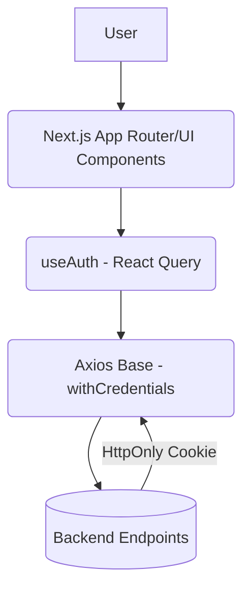

# Thiết kế Hệ thống & Kiến trúc

## Tổng quan Kiến trúc

Luồng xác thực tập trung vào Client Side có SSR (Tầng App Router). Dữ liệu được fetch tự động và cache qua React Query.

## Mô hình Dữ liệu

Dữ liệu cốt lõi là Auth Profile (DTO):

- `User`: `{ id, username, email, role: 'admin' | 'staff' | 'customer', avatar, ... }`
- Các luồng Query: Trả về kiểu `User | null`.

## Thiết kế API và Axios Instance

Sử dụng thư viện **Axios** kết hợp Interceptors mạnh mẽ:

- Bật `withCredentials = true`.
- **Response Interceptor**:
  - Bắt lỗi `Code 401`.
  - Khởi tạo `isRefreshing = true` và một mảng dự phòng `failedQueue = []`.
  - Giữ (pause) toàn bộ request đi sau nếu đang `isRefreshing`, đưa chúng vào `failedQueue`.
  - Khởi chạy quá trình call `POST /auth/refresh`.
  - Sau khi lấy được Cookie mới, lặp qua queue thả tất cả request trước đó tiếp tục chạy. Nếu thất bại, Reject Promise của tất cả để Force Logout.

## Phân chia Thành phần

Tổ chức theo Feature-Sliced Design chuẩn:

1. `libs/api/http.ts`: Trái tim - Cấu hình Axios config & interceptor.
2. `features/auth/api/auth.api.ts`: API Services (các func gọi BE).
3. `features/auth/hooks/useAuth.ts`: (Query SoT) - Trigger `/profile`.
4. `features/auth/hooks/useLogin.ts`, `useLogout.ts`: Mutations.
5. `features/auth/components/RoleGuard.tsx`: Component bảo vệ UI.
6. `middleware.ts`: Ngăn chặn route cấp độ Server Edge.

## Yêu cầu Phi chức năng

- Bảo mật tuyệt đối bằng Cookie (tránh XSS).
- Chống SSR chớp nháy (Flash of unauthenticated content). Mọi private route phải qua Middleware Next.js kiểm tra.
