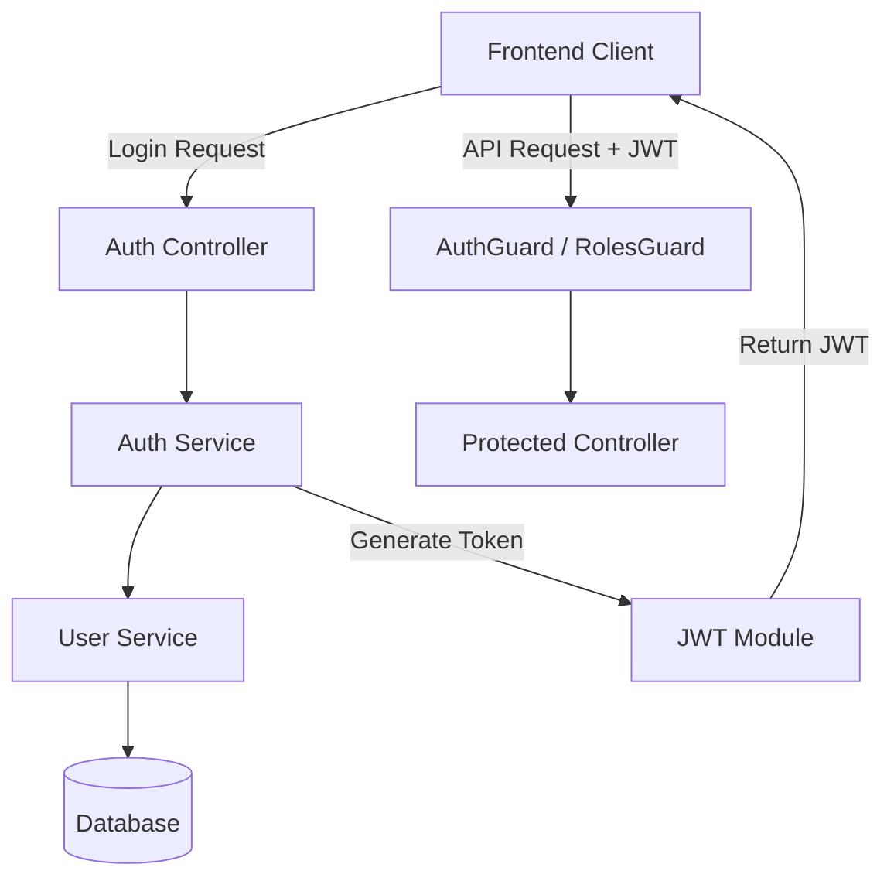

# Thiết kế Hệ thống & Kiến trúc

## Tổng quan Kiến trúc

**Cấu trúc cấp cao của hệ thống như thế nào?**

- **AuthModule:** Mô-đun trung tâm xử lý đăng nhập và cấp phát token.
- **JwtStrategy:** Xử lý việc giải mã và xác thực token gửi kèm trong header của các request.
- **RolesGuard:** Kiểm tra quyền hạn (Role) của người dùng trước khi cho phép truy cập API.

## Mô hình Dữ liệu

**Chúng ta cần quản lý dữ liệu gì?**

- **User Entity:**
  - `id`: UUID
  - `username`: string (unique)
  - `password`: string (hashed)
  - `role`: enum ('admin', 'staff')
  - `firstName`, `lastName`: string

## Thiết kế API

**Các thành phần giao tiếp với nhau như thế nào?**

- `POST /auth/login`: Xác thực người dùng và trả về JWT.
- `GET /auth/profile`: Lấy thông tin người dùng hiện tại (yêu cầu JWT).
- Các API khác sẽ được bảo vệ bằng `@UseGuards(JwtAuthGuard, RolesGuard)`.

## Phân chia Thành phần

**Các khối xây dựng chính là gì?**

- **Backend:**
  - `AuthService`: Logic xử lý mật khẩu (bcrypt) và tạo token.
  - `LocalStrategy`: Xác thực bằng username/password.
  - `JwtStrategy`: Xác thực bằng token.
  - `RolesGuard`: Middleware kiểm tra quyền.

## Quyết định Thiết kế

**Tại sao chúng ta chọn cách tiếp cận này?**

- **JWT:** Phù hợp cho kiến trúc RESTful API, không trạng thái (stateless), dễ dàng mở rộng cho cả Nhân viên và Khách (nếu cần).
- **Session-based for Guests:** Đối với khách hàng, thay vì bắt buộc đăng nhập, chúng ta sử dụng một `SessionToken` được gắn với bàn. Token này có thể được mã hóa trong QR code.
- **Passport.js:** Thư viện chuẩn cho xác thực trong Node.js/NestJS.
- **Bcrypt:** Thuật toán băm mật khẩu bảo mật và phổ biến.

## Thiết kế Phiên khách hàng (Guest Session)

- **Cơ chế:** Khi nhân viên mở bàn, hệ thống tạo một `TableSession` bản ghi trong DB và sinh ra một mã định danh duy nhất (UUID/JWT ngắn hạn).
- **QR Code:** Chứa URL kèm theo mã định danh này (ví dụ: `https://q-dine.com/menu?session=xyz`).
- **Xác thực:** Frontend sẽ gửi mã định danh này trong header `X-Guest-Token` cho các API đặt món. Backend kiểm tra mã này có khớp với bàn đang "Active" hay không.

## Yêu cầu Phi chức năng

**Hệ thống cần vận hành như thế nào?**

- **Bảo mật:** Mật khẩu không bao giờ được lưu dưới dạng văn bản thuần túy.
- **Hiệu suất:** Quá trình xác thực token phải diễn ra nhanh chóng (< 50ms).
- **Khả dụng:** Hệ thống phải hoạt động ổn định để không chặn người dùng truy cập các tính năng khác.
