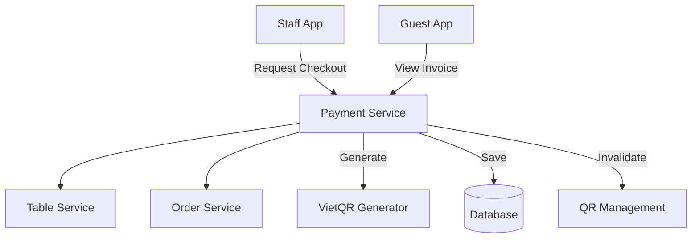

# Thiết kế Hệ thống & Kiến trúc

## Tổng quan Kiến trúc

**Cấu trúc cấp cao của hệ thống như thế nào?**

## Mô hình Dữ liệu

**Chúng ta cần quản lý dữ liệu gì?**

- **Invoice Entity:**
  - `id`: UUID (PK)
  - `invoiceCode`: string (Unique, ví dụ: HD-20240211-001)
  - `totalAmount`: decimal
  - `discount`: decimal
  - `finalAmount`: decimal
  - `paymentMethod`: enum ("CASH", "TRANSFER")
  - `status`: enum ("PENDING", "PAID", "CANCELLED")
  - `staffId`: UUID (Người xác nhận)
  - `tableSessions`: TableSession[] (Danh sách các phiên bàn được gộp)
  - `createdAt`: timestamp

## Thiết kế API

**Các thành phần giao tiếp với nhau như thế nào?**

- `GET /payments/preview?tableIds=1,2`: Xem trước hóa đơn (gộp bàn nếu có nhiều ID).
- `POST /payments/confirm`: Nhân viên xác nhận đã nhận tiền, đóng các session và in hóa đơn.
- `GET /payments/qr?amount=xxx`: Lấy mã VietQR cho khách.

## Phân chia Thành phần

**Các khối xây dựng chính là gì?**

- `PaymentModule`: Xử lý logic tính toán và hóa đơn.
- `InvoiceGenerator`: Component tạo định dạng hóa đơn để in.
- `RevenueService`: Xử lý dữ liệu cho báo cáo của Admin.

## Quyết định Thiết kế

**Tại sao chúng ta chọn cách tiếp cận này?**

- **TableSession Association:** Hóa đơn liên kết với `TableSession` thay vì trực tiếp `Table`, giúp lưu trữ lịch sử chính xác theo từng lượt khách.
- **VietQR:** Sử dụng chuẩn mã QR thanh toán chung giúp khách hàng dùng bất kỳ app ngân hàng nào cũng có thể quét được.

## Yêu cầu Phi chức năng

**Hệ thống cần vận hành như thế nào?**

- **Tính toàn vẹn:** Khi thanh toán gộp, tất cả các bàn liên quan phải được mở trạng thái `AVAILABLE` cùng lúc.
- **Bảo mật:** Chỉ Nhân viên/Admin mới có quyền gọi API `confirm`.
