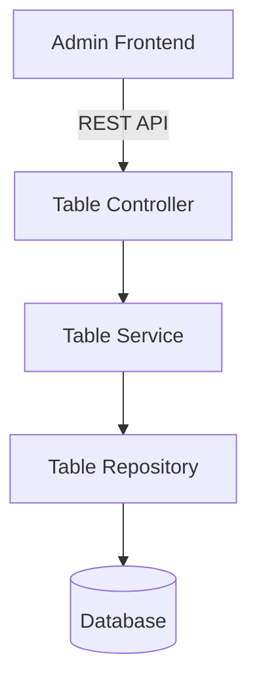

# Thiết kế Hệ thống & Kiến trúc

## Tổng quan Kiến trúc

**Cấu trúc cấp cao của hệ thống như thế nào?**

## Mô hình Dữ liệu

**Chúng ta cần quản lý dữ liệu gì?**

- **Table Entity:**
  - `id`: UUID (Primary Key)
  - `tableNumber`: string (Unique, ví dụ: "A01", "B05")
  - `capacity`: number (Số chỗ ngồi)
  - `status`: enum ("AVAILABLE", "OCCUPIED", "RESERVED")
  - `createdAt`: timestamp
  - `updatedAt`: timestamp

## Thiết kế API

**Các thành phần giao tiếp with nhau như thế nào?**

- `GET /tables`: Lấy danh sách tất cả bàn.
- `GET /tables/:id`: Lấy chi tiết một bàn.
- `POST /tables`: Tạo bàn mới.
- `PATCH /tables/:id`: Cập nhật thông tin bàn.
- `DELETE /tables/:id`: Xóa bàn.

## Phân chia Thành phần

**Các khối xây dựng chính là gì?**

- `TableModule`: Module quản lý logic bàn.
- `TableController`: Xử lý HTTP requests và xác thực quyền Admin.
- `TableService`: Chứa logic nghiệp vụ xử lý dữ liệu bàn.
- `TableEntity`: Định nghĩa cấu trúc bảng trong DB (TypeORM).

## Quyết định Thiết kế

**Tại sao chúng ta chọn cách tiếp cận này?**

- **RESTful API:** Tuân thủ tiêu chuẩn thiết kế API hiện có của dự án.
- **TypeORM:** Sử dụng ORM để quản lý dữ liệu bền vững và dễ dàng migration.

## Yêu cầu Phi chức năng

**Hệ thống cần vận hành như thế nào?**

- **Bảo mật:** Chỉ user có role `ADMIN` mới được phép thực hiện các thao tác ghi (POST/PATCH/DELETE).
- **Tính toàn vẹn:** Không cho phép xóa bàn nếu đang có một phiên (session) hoạt động.
