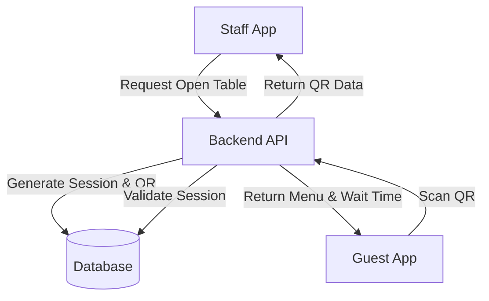

# Thiết kế Hệ thống & Kiến trúc

## Tổng quan Kiến trúc

**Cấu trúc cấp cao của hệ thống như thế nào?**

## Mô hình Dữ liệu

**Chúng ta cần quản lý dữ liệu gì?**

- **Table Entity:** `id`, `tableNumber`, `status` (Available, Occupied).
- **TableSession Entity:** `id`, `tableId`, `sessionToken` (Unique), `status` (Active, Completed), `createdAt`, `completedAt`.

## Thiết kế API

**Các thành phần giao tiếp với nhau như thế nào?**

- `POST /tables/{id}/open`: Tạo session mới cho bàn, sinh QR.
- `POST /tables/{id}/checkout`: Kết thúc session, vô hiệu hóa QR.
- `GET /menu?session={token}`: Lấy menu cho khách quét QR.

## Phân chia Thành phần

**Các khối xây dựng chính là gì?**

- `QRGeneratorService`: Dịch vụ tạo mã QR từ URL.
- `TableGateway`: Xử lý cập nhật trạng thái bàn thời gian thực (Websocket).
- `WaitTimeService`: Tính toán thời gian dựa trên hàng đợi đơn hàng.

## Quyết định Thiết kế

**Tại sao chúng ta chọn cách tiếp cận này?**

- **Dynamic QR:** Mỗi khách một session giúp tách biệt hóa đơn và lịch sử gọi món.
- **Websockets:** Cập nhật trạng thái bàn cho nhân viên ngay khi có thay đổi.
