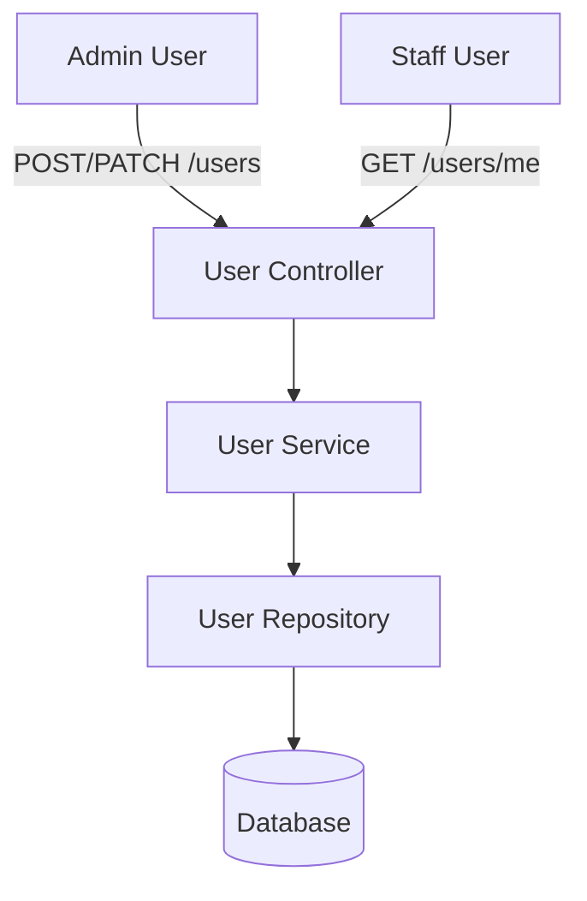

# Thiết kế Hệ thống & Kiến trúc

## Tổng quan Kiến trúc

**Cấu trúc cấp cao của hệ thống như thế nào?**

## Mô hình Dữ liệu

**Chúng ta cần quản lý dữ liệu gì?**

- **User Entity (Cập nhật):**
  - `id`: UUID (PK)
  - `username`: string (Unique)
  - `password`: string (Hashed)
  - `fullName`: string
  - `role`: enum ("ADMIN", "STAFF")
  - `isActive`: boolean (Mặc định: true)
  - `lastLogin`: timestamp
  - `createdAt`, `updatedAt`: timestamp

## Thiết kế API

**Các thành phần giao tiếp với nhau như thế nào?**

- **Dành cho Admin (Roles: ADMIN):**
  - `GET /users`: Liệt kê tất cả người dùng.
  - `POST /users`: Tạo người dùng mới.
  - `PATCH /users/:id`: Cập nhật thông tin/vai trò/trạng thái người dùng.
  - `DELETE /users/:id`: Xóa người dùng (hoặc chuyển `isActive` sang false).
- **Dành cho Bản thân (Roles: ANY):**
  - `GET /users/me`: Lấy thông tin cá nhân.
  - `PATCH /users/me`: Cập nhật thông tin cá nhân/đổi mật khẩu.

## Phân chia Thành phần

**Các khối xây dựng chính là gì?**

- `UserModule`: Module quản lý dữ liệu người dùng.
- `BcryptService`: Tiện ích băm và kiểm tra mật khẩu.
- `RolesGuard`: Middleware kiểm tra quyền truy cập dựa trên Role.

## Quyết định Thiết kế

**Tại sao chúng ta chọn cách tiếp cận này?**

- **Soft Delete/Inactivate:** Ưu tiên khóa tài khoản (`isActive = false`) thay vì xóa vật lý để giữ lại lịch sử giao dịch/đơn hàng liên quan đến nhân viên đó.
- **Separation of Concerns:** Tách biệt `UsersService` (xử lý dữ liệu) khỏi `AuthService` (xử lý JWT).

## Yêu cầu Phi chức năng

**Hệ thống cần vận hành như thế nào?**

- **Bảo mật:** Mật khẩu tối thiểu 6 ký tự, phải được băm bằng bcrypt trước khi lưu.
- **Audit:** Lưu thời gian cập nhật cuối cùng cho mỗi bản ghi.
